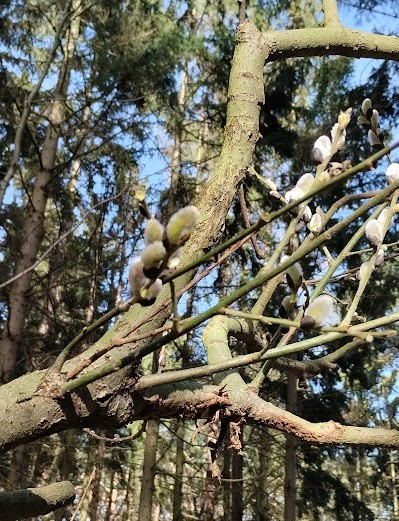

# Willow pollen collected

Today I was lucky to collect a lot of willow pollen samples while walking in the park. I was hunting for just any pollen samples (to be later used to test the _OPPC_), and I was hoping for some birch pollen. However, birch is not blooming yet in Hamburg.

It is sometimes hard to collect pollen in the park because the trees are high and you can't reach any aglet/catkin from the ground. But this willow tree has recently fallen, and it was blooming just on the ground level. I was happy to collect a plastic bag of catkins full of pollen.

I can't say which type of a willow it was. Probably, it was [Salix caprea L.](https://identify.plantnet.org/ru/k-middle-europe/species/Salix%20caprea%20L./data) or [Salix myrsinifolia Salisb.](https://identify.plantnet.org/ru/k-middle-europe/species/Salix%20myrsinifolia%20Salisb./data), but it could also be [Salix repens L.](https://identify.plantnet.org/ru/k-middle-europe/species/Salix%20repens%20L./data) or [Salix atrocinerea Brot.](https://identify.plantnet.org/ru/k-middle-europe/species/Salix%20atrocinerea%20Brot./data).