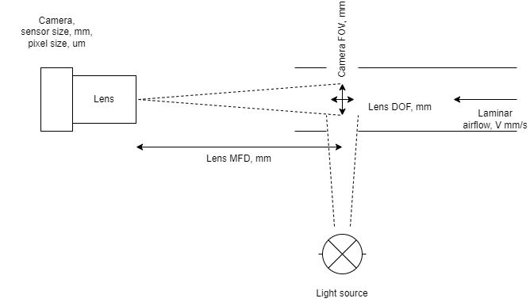
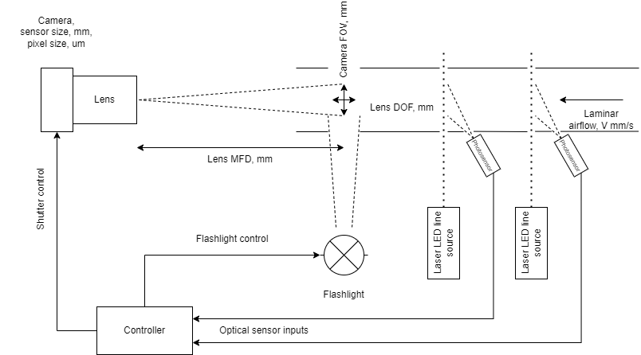

# Method of measurement

My original idea was around making a _continuous_ series of photos of a section of a laminar flow of air containing pollen particles. Pollen particles should be illuminated by a strong light source in otherwise dark ambient conditions so that they appear as light blobs in the dark to the camera. 

I had my master's thesis around detecting pathologic blood cells in the blood sample by processing the microphotographs, first detecting cells and their form/color, and then processing with algorithms. That was quite successful. So I want to use the same method on pollen - detect single pollen particles in the air and then classify them by size, form, etc.

Processing passing air requires no obvious spares, so it should be [low maintenance](project_goals.md#maintainability). Of course, some periodic cleaning of the insides from dust and pollen and changing coarse air filters (blocking poplar fluff and alike) may be required yearly or 2-3 per year. 

## Streaming approach

The simplest way would be just to make a series of photos with equal intervals and detect particles in the photos.

In a picture, a laminar airflow is passing with a constant speed, **V**(mm), through the camera **DOF**(mm) - depth of field zone. DOF is illuminated by a powerful light source - it should be powerful enough to keep camera exposure time short. To photograph all passing air we will need **FPS**=V/DOF frames per second. 

A camera with sensor size __Xs\*Ys__(mm), pixel pitch **Pp**(um) - pixels are usually rectangular, and sensor resolution __X\*Y__=(Xs\*1000/Pp, Ys\*1000/Pp), needs to see some area across the beam of the light source - camera FOV=HFOV\*VFOV (field of view, mm\*mm).

A lens provides the DOF for the camera at some focusing distance. At a minimal focusing distance, MFD(mm), the lens provides the best magnification, but the smallest FOV.

Then the challenge is that we ideally need a camera with very high resolution in MPix to work continuously at high FPS, using a very fast connection (USB3, or MIPI DSI with 4 lanes), and a lens with the best optical resolution. This is why:
- The volume processed in one shot will be defined by HFOV\*VFOV\*DOF, and a total airflow would be limited by HFOV\*VFOV\*DOF\*FPS;
- We need to [process a significant air volume](#processed-air-volume) to count pollen particles at lower concentrations, thus we want to increase either FPV, FOV, or DOF;
- Increasing FOV means that the area covered by the sensor pixels increases, but it is not that easy as zooming the lens out. We want to see pollen particles as some significant blobs in the picture. Suppose that we'd like to see a 20um pollen grain as an 8-pixel blob, and an 8-MPix camera sensor is 3840 pixels wide. Then our HFOV would cover no more than 20E-3/8\*3840=9.6mm. That's small, and to increase it we can only select more expensive cameras with more megapixels.
- Increasing DOF generally requires selecting a proper lens, probably with a smaller aperture. Those beasts are not easy to find and there are not so many lenses out there created for this type of job, as we'll later see. So, we'll use whatever we could find and won't have much choice.
- Increasing FPS is a way to go, but it generally requires fast interfaces. Let's consider [an 8.3MPix IMX334 sensor working a 45FPS](https://docs.baslerweb.com/daa3840-45um), as used in a prototype build: with a resolution of 3840\*2160, 45FPS and 12bits per pixel it requires 3840\*2160\*45\*12=4.478 GBit/s data link, which then is topping a USB3.0 SuperSpeed connection. 
- In general, increasing FPS and data rate requires more processing power of an embedded computer that is going to pre-process the image flow, but it seems like a lesser problem nowadays.

It is easy to see that the practical limit here is the sensor. As MPix in a sensor is tightly coupled to HFOV\*VFOV, and MPix\*FPS are limited by an obtainable physical connection, the whole system is limited by the amount of airflow it can process with this method.

Another practical limit is the cost - selecting faster cameras and better lenses costs more money and the project is easy to go beyond the target cost, not even speaking of R&D costs (in this case - the money I have to throw to buy test parts and check them out).

To relieve these constraints, [a second method was selected](#shutter-control-approach).

### Processed air volume

The volume that is processed in a single shot is defined as the camera+lens FOV=HFOV\*VFOV (field of view, mm\*mm) area multiplied by the DOF. As we are going to photograph something small, it is already obvious that the size of a FOV would possibly be in the range of millimeters. The DOF would also be on a millimeter scale (OK, maybe you don't know yet, but we'll see it soon). 

That's what it practically means: if we have a FOV of, say, 8*\6 mm and a DOF of 2mm, the camera+lens system shoots 8\*6\*2=96 cubic mm. of air in one shot. At 30FPS it will process 30\*96=2880 cubic mm and in one hour - 2880*3600=10.368 million cubic mm, or just 10.368 liters of air - that's only 1% of a cubic meter. We want to [detect between 100 and 10000 particles per cubic meter](project_goals.md#objective-technical-data), and at the lowest concentration, the system would see just one pollen particle in an hour. Rather it would see 24 particles in 24 hours and then we say - yes, the pollen concentration is somewhere around 100/cubic.m. The system would work but would have a very slow response, which is unwanted.

If we can design a system to process 40 liters per hour, it would detect 16 samples in 4 hours and it could then say, in practical means, that the concentration is around 100/cubic.m. just in 4 hours - that's much better. 

> Of course, by measuring 16 particles in 4 hours we can's precisely say it is 100 particles per cubic meter - we can just assume that the real average concentration over these 4 hours lies in some range of values, say, 70..130, with some probability, like 95%. But that's scientific results. For [practical results](project_goals.md#practical-vs-scientific) this is fine: this concentration is rather small to cause any allergy, and for most allergic people such a value is just an indicator that the pollen season is starting. And at higher concentrations per cubic meter, when it matters more if it is 5000 or 7000 we automatically get better results by counting more particles per hour.

Liters/hour is a major practical design constraint for the system. We would optimize the system to improve this value. Let's define some practical values:

| l/h of processed air | Applicability
| ------- | -------
| < 20    | Poor
| 20..40  | Acceptable
| 40..100 | Good
| > 100   | Excellent

It's still a question if we could ever achieve excellent results.

## Shutter control approach

We improve on a method by installing 2 reflective particle detectors in a way of airflow.

Here, 2 pairs of reflective sensors are installed in the airflow path. Each sensor consists of a laser source with a line pattern and a photodiode. Line pattern laser source means it projects a line on a surface, but it also means that the laser light passes through a section of an airflow, e.g. it is a plane in the airflow crosssection lit with laser light. Then any pollen particle spotted by this light will reflect some light which is caught by the photosensor. Of course, the light should be very bright and the sensor very sensitive to detect that, because the reflective area of the pollen is very small.

Having two sensors in a row allows to detection of the speed *V* of the airflow. To do this, waveforms from both sensors are correlated. The controller then calculates appropriate times to trigger the flashlight source and the camera shutter to photograph the particle when it approaches the middle of the camera's DOF.

This approach has several advantages:
- No requirement to photograph the whole airflow as a series of DOF-deep images, this makes our FPS constraint not important. Consider this as having virtually infinite FPS.
- The camera can be triggered when the particle is exactly in its focal plane, allowing for the best optical quality.
- The light source is replaced with a flashlight. Practically it will be an LED source in both cases, but when the LED is operated in a pulsed (flash) mode, it can create pulses of a much brighter light. In addition, when operated in the pulsed mode, the heat the LED produces is times less than in a constant mode. Practically this creates a much more bright source of light with fewer concerns of overheating.

This is the approach used in _OPPC_ currently.
